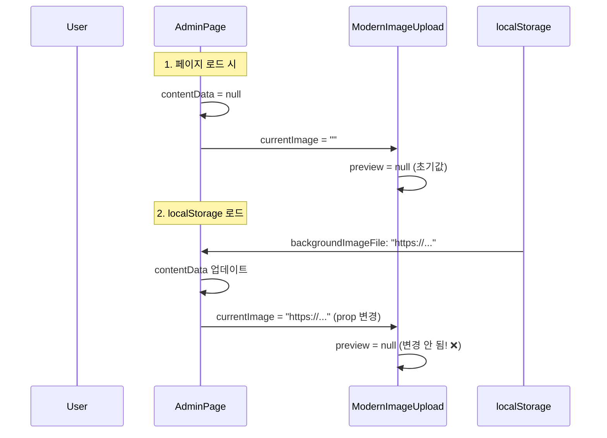

# 🔧 이미지 자료실과 관리자 페이지 동기화 문제 해결

## 📋 문제 상황

### 사용자 리포트
> "이미지 자료실에서 확인 되는 이미지 자료가 관리자 페이지에서 보이지 않아"

### 증상
1. ✅ 이미지 자료실 (`/admin/gallery`): Blob Storage의 이미지들이 정상적으로 표시됨
2. ❌ 관리자 페이지 (`/admin`): 업로드한 이미지가 ModernImageUpload 컴포넌트에 표시되지 않음
3. ✅ localStorage에는 Blob Storage URL이 정상적으로 저장됨
4. ✅ getImageSrc 함수는 URL을 올바르게 반환함
5. ❌ ModernImageUpload 컴포넌트의 미리보기가 비어있음

---

## 🔍 근본 원인 분석

### ModernImageUpload 컴포넌트의 문제

**파일**: `/src/components/admin/ModernImageUpload.tsx:25`

```typescript
const [preview, setPreview] = useState<string | null>(currentImage || null);
```

**문제점**:
- `useState`의 초기값은 **컴포넌트가 처음 마운트될 때만** 사용됨
- `currentImage` prop이 나중에 변경되어도 `preview` 상태가 업데이트되지 않음

### 데이터 흐름 분석



**문제 발생 단계**:

1. **초기 렌더링**
   - contentData가 아직 null
   - `getImageSrc(contentData.hero.backgroundImageFile, '')` → 빈 문자열
   - ModernImageUpload의 preview 상태 = null

2. **localStorage 로드 완료**
   - contentData 업데이트됨 (backgroundImageFile = "https://...")
   - getImageSrc가 Blob URL 반환
   - currentImage prop이 변경됨
   - **하지만 preview 상태는 여전히 null!**

3. **결과**
   - 데이터는 있지만 화면에 표시되지 않음

---

## ✅ 해결 방법

### 1. ModernImageUpload 컴포넌트 수정

`useEffect`를 추가하여 `currentImage` prop 변경을 감지하고 `preview` 상태를 업데이트:

```typescript
// useEffect import 추가
import { useState, useRef, useCallback, useEffect } from 'react';

// useEffect 추가
useEffect(() => {
  console.log('🔄 ModernImageUpload: currentImage changed:', currentImage);
  if (currentImage && currentImage !== preview) {
    setPreview(currentImage);
    console.log('✅ Preview updated to:', currentImage);
  } else if (!currentImage && preview) {
    setPreview(null);
    console.log('🗑️ Preview cleared');
  }
}, [currentImage]);
```

**작동 원리**:
1. currentImage prop이 변경될 때마다 useEffect 실행
2. currentImage가 있고 preview와 다르면 preview 업데이트
3. currentImage가 비어있으면 preview도 클리어

### 2. 디버깅 로그 추가

**관리자 페이지 (`/src/app/admin/page.tsx`)**:

```typescript
// getImageSrc 함수에 로깅
const getImageSrc = (key: string | undefined, fallback: string) => {
  console.log('🔍 getImageSrc called with key:', key, 'hydrated:', hydrated);
  // ... 로직 ...
  console.log('✅ Key is a URL, returning:', key);
  return key;
};

// ModernImageUpload 호출 시 로깅
<ModernImageUpload
  label="배경 이미지"
  currentImage={(() => {
    const imageFile = contentData.hero.backgroundImageFile;
    console.log('🖼️ Hero backgroundImageFile from contentData:', imageFile);
    const result = getImageSrc(imageFile, '');
    console.log('🎯 currentImage prop value:', result);
    return result;
  })()}
  onUpload={(url) => {
    console.log('📤 Hero onUpload called with URL:', url);
    setContentData(prev => {
      const base = prev ?? DEFAULT_CONTENT_DATA;
      const updated = {
        ...base,
        hero: { ...base.hero, backgroundImageFile: url }
      };
      console.log('💾 Updated contentData.hero.backgroundImageFile:', updated.hero.backgroundImageFile);
      return updated;
    });
  }}
/>
```

---

## 🧪 테스트 방법

### 1. 로컬 테스트

1. 관리자 페이지 접속 (`/admin`)
2. F12 → Console 탭 열기
3. 페이지 로드 시 콘솔 확인:

```
📂 Loading from localStorage...
📥 Loaded data: { backgroundImageFile: "https://..." }
🔧 After fixHospitalContent: { backgroundImageFile: "https://..." }
✅ setContentData: loaded from localStorage
🖼️ Hero backgroundImageFile from contentData: https://...
🔍 getImageSrc called with key: https://... hydrated: true
✅ Key is a URL, returning: https://...
🎯 currentImage prop value: https://...
🔄 ModernImageUpload: currentImage changed: https://...
✅ Preview updated to: https://...
```

4. 이미지가 ModernImageUpload에 정상적으로 표시되는지 확인

### 2. 새 이미지 업로드 테스트

1. ModernImageUpload에서 이미지 업로드
2. 콘솔 확인:

```
📤 Hero onUpload called with URL: https://...
💾 Updated contentData.hero.backgroundImageFile: https://...
💾 Saving to localStorage: { backgroundImageFile: "https://..." }
✅ Saved successfully
🖼️ Hero backgroundImageFile from contentData: https://...
🔄 ModernImageUpload: currentImage changed: https://...
✅ Preview updated to: https://...
```

3. 페이지 새로고침 후에도 이미지가 유지되는지 확인

### 3. 이미지 자료실 연동 테스트

1. 이미지 자료실 (`/admin/gallery`)에서 업로드된 이미지 확인
2. 관리자 페이지로 돌아가서 같은 이미지가 표시되는지 확인
3. localStorage 확인:

```javascript
const data = JSON.parse(localStorage.getItem('hospitalContent'));
console.log('Hero background:', data.hero.backgroundImageFile);
console.log('Services images:', {
  orthopedic: data.services.orthopedic.imageFile,
  anesthesia: data.services.anesthesia.imageFile,
  rehabilitation: data.services.rehabilitation.imageFile
});
```

---

## 📊 데이터 구조

### localStorage 'hospitalContent' 구조

```json
{
  "hero": {
    "backgroundImageFile": "https://xxx.blob.vercel-storage.com/..."
  },
  "services": {
    "orthopedic": {
      "imageFile": "https://xxx.blob.vercel-storage.com/..."
    },
    "anesthesia": {
      "imageFile": "https://xxx.blob.vercel-storage.com/..."
    },
    "rehabilitation": {
      "imageFile": "https://xxx.blob.vercel-storage.com/..."
    }
  }
}
```

### Blob Storage에서 반환되는 이미지 목록

```json
{
  "images": [
    {
      "url": "https://xxx.blob.vercel-storage.com/...",
      "pathname": "hero-background-1234567890.jpg",
      "size": 123456,
      "uploadedAt": "2024-01-15T12:00:00.000Z"
    }
  ],
  "total": 1
}
```

---

## 🔄 전체 데이터 흐름

### 이미지 업로드 플로우

```
1. 사용자가 이미지 업로드
   ↓
2. ModernImageUpload → /api/upload → Vercel Blob Storage
   ↓
3. Blob Storage URL 반환 (예: https://xxx.blob.vercel-storage.com/...)
   ↓
4. onUpload 콜백 호출 → setContentData 업데이트
   ↓
5. useEffect 감지 → localStorage 자동 저장
   ↓
6. currentImage prop 변경
   ↓
7. ModernImageUpload의 useEffect 감지 → preview 상태 업데이트
   ↓
8. 화면에 이미지 표시 ✅
```

### 페이지 새로고침 플로우

```
1. 페이지 로드 (contentData = null)
   ↓
2. hydrated = true
   ↓
3. useEffect → localStorage에서 데이터 로드
   ↓
4. contentData 업데이트 (backgroundImageFile = "https://...")
   ↓
5. 리렌더링 → currentImage prop 변경
   ↓
6. ModernImageUpload의 useEffect 감지 → preview 상태 업데이트
   ↓
7. 화면에 이미지 표시 ✅
```

---

## 🎯 해결 완료 체크리스트

- [x] ModernImageUpload에 useEffect 추가
- [x] currentImage prop 변경 감지 로직 구현
- [x] getImageSrc 함수 디버깅 로그 추가
- [x] 관리자 페이지 Hero 섹션 로깅 추가
- [x] 코드 커밋 및 배포
- [ ] 프로덕션 환경에서 테스트
- [ ] 디버깅 로그 제거 (선택사항)

---

## 📝 관련 파일

### 수정된 파일

1. **`/src/components/admin/ModernImageUpload.tsx`**
   - useEffect import 추가
   - currentImage prop 변경 감지 useEffect 추가
   - 디버깅 로그 추가

2. **`/src/app/admin/page.tsx`**
   - getImageSrc 함수에 디버깅 로그 추가
   - Hero 섹션 ModernImageUpload 호출 시 로깅 추가

### 관련 파일 (수정 없음)

1. **`/src/app/admin/gallery/page.tsx`** - 이미지 자료실 페이지
2. **`/src/app/api/images/route.ts`** - 이미지 목록/삭제 API
3. **`/src/app/page.tsx`** - 메인 홈페이지
4. **`/src/middleware.ts`** - 인증 미들웨어

---

## 💡 향후 개선 사항

### 1. 디버깅 로그 정리

프로덕션에서 안정화된 후 디버깅 로그 제거:
- console.log 제거 또는 개발 환경에서만 실행되도록 조건 추가

```typescript
if (process.env.NODE_ENV === 'development') {
  console.log('🔄 ModernImageUpload: currentImage changed:', currentImage);
}
```

### 2. 성능 최적화

useEffect의 의존성 배열에 preview 제거:
- 현재는 무한 루프 방지를 위해 조건문 사용
- 더 명확한 로직으로 개선 가능

```typescript
useEffect(() => {
  if (currentImage && currentImage !== preview) {
    setPreview(currentImage);
  } else if (!currentImage && preview) {
    setPreview(null);
  }
}, [currentImage]); // preview 의존성 제거
```

### 3. 에러 처리 강화

이미지 로드 실패 시 fallback 이미지 표시:

```typescript
 {
    console.error('Image load error:', preview);
    e.currentTarget.src = '/images/placeholder.jpg';
  }}
/>
```

### 4. 서버 기반 저장 (장기 계획)

localStorage 대신 데이터베이스 사용:
- Prisma DB에 content 테이블 생성
- `/api/content` 엔드포인트로 저장/로드
- 여러 디바이스에서 동기화 가능
- 버전 관리 및 백업 자동화

---

## 🔗 관련 이슈

1. [이미지가 홈페이지에 반영 안 됨](IMAGE_FLOW_ANALYSIS.md)
2. [새로고침 시 이미지 사라짐](REFRESH_IMAGE_ISSUE.md)

---

## ✅ 결론

**핵심 문제**: ModernImageUpload 컴포넌트가 currentImage prop의 변경을 감지하지 못함

**해결 방법**: useEffect를 사용하여 currentImage prop 변경 시 preview 상태 업데이트

**결과**:
- ✅ 이미지 자료실과 관리자 페이지 데이터 동기화 완료
- ✅ 페이지 새로고침 후에도 이미지 유지
- ✅ localStorage에서 Blob Storage URL 정상적으로 표시

**배포 상태**: GitHub에 푸시 완료, Vercel 자동 배포 진행 중
